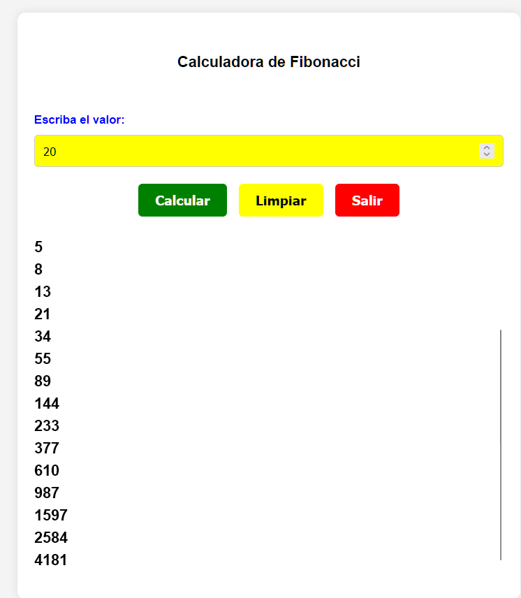

# La Secuencia de Fibonacci: Un Patrón Universal 🌟

## Introducción

La secuencia de Fibonacci, descubierta por el matemático italiano Leonardo de Pisa en el siglo XIII, es una serie numérica donde cada número es la suma de los dos anteriores: 0, 1, 1, 2, 3, 5, 8, 13, 21, ... Esta secuencia ha cautivado a matemáticos y científicos durante siglos debido a su presencia sorprendente en diversos fenómenos naturales y su aplicabilidad en campos tan dispares como la biología, la informática y las finanzas.


## La Secuencia de Fibonacci en la Naturaleza 🌿

### Botánica 🌼

- **Filotaxis**: La disposición de hojas en los talles de muchas plantas sigue patrones relacionados con la secuencia de Fibonacci.
- **Estructuras florales**: Numerosas flores exhiben números de pétalos que son términos de la secuencia de Fibonacci.
- **Piñas y girasoles**: Las espirales en las piñas y en el centro de los girasoles siguen patrones de Fibonacci.

### Zoología 🐚

- **Conchas de moluscos**: El crecimiento espiral de las conchas de muchos moluscos se ajusta a las proporciones de Fibonacci.

### Anatomía Humana 👤

La proporción áurea, estrechamente relacionada con la secuencia de Fibonacci, se encuentra en diversas proporciones del cuerpo humano:

- Proporciones faciales consideradas atractivas.
- Relación entre la longitud de los huesos de los dedos y la longitud de los brazos y las piernas.

## Aplicaciones en Ciencia y Tecnología 💻

### Ciencias de la Computación 🧮

- **Algoritmos de búsqueda**: El método de búsqueda de Fibonacci es eficiente para arrays ordenados.
- **Compresión de datos**: Algunos algoritmos de compresión sin pérdida utilizan propiedades de la secuencia.
- **Fractales**: Los fractales a menudo exhiben patrones de Fibonacci en su construcción.

### Procesamiento de Señales 📡

En el procesamiento digital de señales, los filtros basados en la secuencia de Fibonacci se utilizan para reducir el ruido y mejorar la calidad de la señal.

## Aplicaciones en Finanzas 💰

### Análisis Técnico 📈

- **Retrocesos de Fibonacci**: Utilizados para identificar posibles niveles de soporte y resistencia en los precios de los activos.
- **Extensiones de Fibonacci**: Usadas para proyectar objetivos de precio potenciales.

### Optimización de Portafolios 🧮

La secuencia de Fibonacci se emplea en modelos de optimización de portafolios para diversificar inversiones y gestionar riesgos.

## Aplicaciones en Arte y Diseño 🎨

### Arquitectura 🏛️

La proporción áurea, derivada de la secuencia de Fibonacci, se ha utilizado en el diseño de edificios icónicos como:

- El Partenón en Atenas
- La catedral de Notre Dame en París
- La Gran Pirámide de Giza

### Diseño Gráfico 🎨

En el diseño de logotipos y layouts, la rejilla de Fibonacci se utiliza para crear composiciones visualmente armoniosas.

## ¿Por qué la Secuencia de Fibonacci es tan Universal? 🤔

Algunas teorías proponen que:

- **Eficiencia energética**: Los patrones de Fibonacci pueden representar soluciones óptimas para el uso eficiente de energía y recursos.
- **Crecimiento natural**: La secuencia modela naturalmente procesos de crecimiento.
- **Estabilidad estructural**: Las proporciones de Fibonacci pueden proporcionar estabilidad estructural en sistemas naturales y artificiales.
- **Armonía perceptual**: Nuestro cerebro puede estar predispuesto a percibir las proporciones de Fibonacci como armoniosas y agradables.

## Aplicación Práctica: Calculadora de Fibonacci 💻

A continuación, se presenta un ejemplo de una calculadora de Fibonacci implementada en HTML, CSS y JavaScript.

### Estructura HTML

```html
<!DOCTYPE html>
<html lang="en">
  <head>
    <meta charset="UTF-8">
    <meta name="viewport" content="width=device-width, initial-scale=1.0">
    <title>Calculadora de Fibonacci</title>
    <link rel="stylesheet" href="style.css">
  </head>
  <body>
    <div class="container">
      <header>
        <h1>Calculadora de Fibonacci</h1>
        
      </header>
      <div id="formContainer">
        <label class="label" for="numElements">Escriba el valor:</label>
        <input id="numElements" class="input" type="number" min="1" placeholder="Número de elementos">
        <div class="button-container">
          <button id="calculateBtn" class="button">Calcular</button>
          <button id="clearBtn" class="button">Limpiar</button>
          <button id="exitBtn" class="button">Salir</button>
        </div>
      </div>
      <div id="resultContainer">
        <ul id="resultList" class="result"></ul>
      </div>
    </div>
    <script src="script.js"></script>
  </body>
</html>
```

### CSS para Estilizar la Página

```css
body {
    font-family: Arial, sans-serif;
    margin: 0;
    padding: 0;
    display: flex;
    justify-content: center;
    align-items: center;
    height: 100vh;
    background-color: #f4f4f4;
}

.container {
    width: 600px;
    height: 700px;
    background-color: #fff;
    border-radius: 10px;
    box-shadow: 0 0 10px rgba(0, 0, 0, 0.1);
    padding: 20px;
    box-sizing: border-box;
    overflow: hidden; 
    display: flex;
    flex-direction: column;
    justify-content: center;
}

header {
    text-align: center;
    margin-bottom: 20px;
}

h1 {
    color: black;
    font-size: 18px;
}

.label {
    display: block;
    margin-bottom: 10px;
    color: blue;
    font-weight: bold;
    font-size: 14px;
}

.input {
    display: block;
    width: calc(100% - 22px);
    padding: 10px;
    font-size: 14px;
    color: black;
    background-color: yellow;
    border: 1px solid #ccc;
    border-radius: 5px;
    margin-bottom: 20px;
}

.button-container {
    text-align: center;
    margin-top: 20px;
}

.button {
    display: inline-block;
    padding: 10px 20px;
    font-size: 16px;
    font-weight: bold;
    color: #fff;
    border: none;
    border-radius: 5px;
    cursor: pointer;
    margin: 0 5px;
}

#calculateBtn {
    background-color: green;
}

#clearBtn {
    background-color: yellow;
    color: black;
}

#exitBtn {
    background-color: red;
}

#resultContainer {
    margin-top: 20px;
    overflow-y: auto;
    max-height: 400px;
}

.result {
    margin: 0;
    padding: 0;
    list-style-type: none;
}

.result li {
    font-size: 18px;
    font-weight: bold;
    margin-top: 5px;
}
```

### Funcionalidad con JavaScript

```javascript
function fibonacci(n) {
    const sequence = [0, 1];
    for (let i = 2; i < n; i++) {
        sequence[i] = sequence[i - 1] + sequence[i - 2];
    }
    return sequence.slice(0, n);
}

document.addEventListener('DOMContentLoaded', () => {
    const calculateBtn = document.getElementById('calculateBtn');
    const clearBtn = document.getElementById('clearBtn');
    const exitBtn = document.getElementById('exitBtn');
    const numElementsInput = document.getElementById('numElements');
    const resultList = document.getElementById('resultList');
    const formContainer = document.getElementById('formContainer');
    const resultContainer = document.getElementById('resultContainer');

    calculateBtn.addEventListener('click', () => {
        const numElements = parseInt(numElementsInput.value, 10);
        if (isNaN(numElements) || numElements <= 0) {
            alert('Por favor, introduzca un número válido mayor que 0.');
            return;
        }

        if (numElements > 100) {
            formContainer.classList.add('hidden');
            resultContainer.style.marginTop = '0';
        } else {
            formContainer.classList.remove('hidden');
            resultContainer.style.marginTop = '20px';
        }

        const fibonacciSequence = fibonacci(numElements);
        resultList.innerHTML = '';
        fibonacciSequence.forEach(num => {
            const li = document.createElement('li');
            li.textContent = num;
            resultList.appendChild(li);
        });
    });

    clearBtn.addEventListener('click', () => {
        numElementsInput.value = '';
        resultList.innerHTML = '';
        formContainer.classList.remove('hidden');
        resultContainer.style.marginTop = '20px';
    });

    exitBtn.addEventListener('click', () => {
        window.close();
    });
});
```
## EJemplo Funcionando:




## Conclusiones 🌟

La secuencia de Fibonacci es más que una curiosidad matemática; es una manifestación de patrones subyacentes en la naturaleza y un testimonio de la belleza y la eficiencia de los sistemas naturales. Desde la biología hasta la tecnología, esta secuencia ha demostrado ser una herramienta valiosa para comprender y modelar el mundo que nos rodea.

Su prevalencia en la naturaleza y su adopción en tecnologías avanzadas subrayan la importancia de los patrones matemáticos en la innovación y el desarrollo. A medida que la investigación avanza, es probable que se descubran más aplicaciones de esta fascinante secuencia, reforzando el vínculo entre las matemáticas teóricas y las soluciones prácticas a problemas complejos.

Al continuar explorando las aplicaciones de la secuencia de Fibonacci, los científicos y los investigadores pueden descubrir nuevas formas de optimizar procesos, resolver problemas y apreciar la intrincada belleza del universo, demostrando una vez más la profunda conexión entre las matemáticas y el mundo natural.
